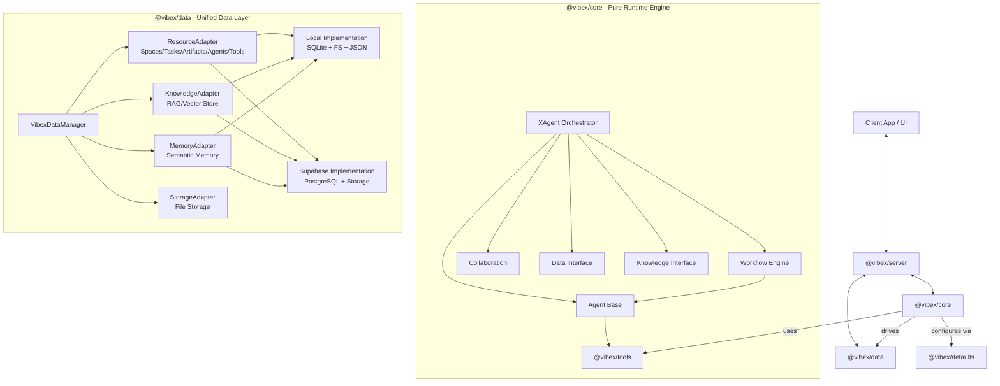

# Vibex System Architecture

## Overview

Vibex is a comprehensive **Multi-Agent Collaboration Engine** designed to build "vibe-working platforms" that excel at interactive user experiences, document chat, and complex autonomous workflows. It bridges the gap between simple chat bots and production-grade agentic automation.

## Core Design Principles

1. **Space-Centric**: All activities happen within a "Space" — a secure container for agents, data, artifacts, and history.
2. **Agent-First but Human-in-the-Loop**: Autonomous agents drive execution, but the workflow engine natively supports pausing for human input and approval.
3. **Storage Agnostic**: Seamlessly switches between local (SQLite/Filesystem) and cloud (Supabase/PostgreSQL) storage without changing application logic.
4. **Interactive & Reactive**: Built for rich UIs, emitting fine-grained events for every step of execution (planning, thinking, tool use, workflow updates).
5. **Core-Driven**: `@vibex/core` is the pure runtime engine that orchestrates and drives all other packages.

## High-Level Architecture



## Package Responsibilities

### `@vibex/core` - The Runtime Engine

**Role**: Pure runtime engine that orchestrates and drives all other packages. Contains NO storage implementations.

**Responsibilities**:

- **Agent System**: Base `Agent` class, agent orchestration via `XAgent`
- **Workflow Engine**: DAG-based workflow execution with pause/resume/human-in-the-loop
- **Orchestration**: `XAgent` coordinates agents, workflows, and knowledge
- **Interfaces**: Defines interfaces for data, knowledge, and storage (NOT implementations)
- **Collaboration**: Multi-agent coordination primitives
- **Execution Logic**: All business logic for agent behavior, planning, tool execution

**What it does NOT contain**:

- ❌ Storage implementations (moved to `@vibex/data`)
- ❌ Vector store implementations (moved to `@vibex/data`)
- ❌ Database adapters (moved to `@vibex/data`)

**Key Principle**: Core defines **WHAT** it needs, Data provides **HOW** to store it.

### `@vibex/data` - Unified Data Persistence Layer

**Role**: Manages **ALL** data used by the core engine. Single source of truth for persistence.

**Responsibilities**:

- **Structured Data** (via `ResourceAdapter`):
  - Spaces, Tasks, Artifacts
  - Agents, Tools
  - Model Providers, Datasources
- **Knowledge/Vector Data** (via `KnowledgeAdapter`):
  - Document chunks and embeddings
  - Vector search operations
  - Dataset management
- **Memory** (via `MemoryAdapter` - to be implemented):
  - Semantic memory for agents
  - Long-term context storage
  - Event-driven memory synthesis
- **File Storage** (via `StorageAdapter`):
  - Artifact file storage
  - Blob management
  - Logical path abstraction

**Implementations**:

- **Local**: SQLite (structured data) + Filesystem (files) + JSON (vectors/memory)
- **Supabase**: PostgreSQL (structured data) + Supabase Storage (files) + pgvector (vectors)

**Key Principle**: Core never touches storage directly. All data access goes through `VibexDataManager`.

### `@vibex/supabase` - Cloud Backend Implementation

**Role**: Concrete implementation of `@vibex/data` adapters using Supabase.

**Responsibilities**:

- `SupabaseResourceAdapter`: PostgreSQL-backed resource operations
- `SupabaseStorageAdapter`: Supabase Storage for files
- `SupabaseKnowledgeAdapter`: pgvector-backed vector operations
- `SupabaseMemoryAdapter`: Semantic memory using Supabase

### `@vibex/tools` - First-Party Tool Library

**Role**: Standard library of tools that agents can use.

**Responsibilities**:

- Web browsing (Playwright)
- File I/O
- Search operations
- Database tools
- Office tools

### `@vibex/react` - React Integration

**Role**: React-facing API for building frontends.

**Responsibilities**:

- React hooks (`useSpace`, `useChat`, etc.)
- Zustand store for client state
- Server actions wrapper
- Error boundaries

### `@vibex/server` - Server Integration

**Role**: Server-only helpers for Next.js/Node.js.

**Responsibilities**:

- Next.js route handlers
- Server actions
- Background job workers
- API route helpers

### `@vibex/defaults` - Configuration & Templates

**Role**: Versioned configurations and templates.

**Responsibilities**:

- Agent templates (YAML)
- Tool configurations
- Space templates
- Prompt templates
- Model configurations

## Data Flow

### Core → Data Interaction

```typescript
// Core defines interfaces
interface DataManager {
  getSpace(id: string): Promise<Space>;
  saveChunks(chunks: DocumentChunk[]): Promise<void>;
  searchChunks(vector: number[], k: number): Promise<DocumentChunk[]>;
  // ... memory operations (to be added)
}

// Core uses data manager (injected dependency)
class XAgent {
  constructor(
    private dataManager: DataManager
    // ...
  ) {}

  async processMessage() {
    // Core orchestrates, Data persists
    const space = await this.dataManager.getSpace(spaceId);
    const chunks = await this.dataManager.searchChunks(vector, 5);
    // ...
  }
}
```

### Memory System (To Be Implemented)

Memory should be part of `@vibex/data` as it's persistent data:

```typescript
// In @vibex/data
interface MemoryAdapter {
  saveMemory(
    content: string,
    metadata: Record<string, unknown>
  ): Promise<string>;
  searchMemory(query: string, k: number): Promise<MemoryItem[]>;
  getRelevantContext(agentName: string, query: string): Promise<string>;
}

// Core uses memory through data manager
class Agent {
  async remember(content: string) {
    await this.dataManager.saveMemory(content, { agentId: this.id });
  }

  async recall(query: string) {
    return await this.dataManager.searchMemory(query, 5);
  }
}
```

## Key Subsystems

### 1. The Workflow Engine

DAG-based workflow execution with:

- Sequential steps, Parallel execution (`race`/`wait_all`)
- Conditionals (`if/else`)
- `human_input` steps
- Persistent `WorkflowContext` for pause/resume

### 2. XAgent (The Orchestrator)

Every Space has an `XAgent` that:

- Understands user intent
- Manages the `Plan`
- Delegates to specialized agents
- Coordinates knowledge retrieval
- Emits events for real-time UI feedback

### 3. Knowledge & RAG

- **Interface in Core**: `VectorStore`, `EmbeddingModel`, `KnowledgeBase`
- **Implementation in Data**: `KnowledgeAdapter` with local/Supabase backends
- Automatic indexing of artifacts for "Chat with Document" features

### 4. Memory (To Be Implemented)

- **Interface in Core**: `MemoryAdapter` interface
- **Implementation in Data**: `MemoryAdapter` with local/Supabase backends
- Semantic memory for agents
- Event-driven synthesis
- Context retrieval for agent prompts

## Migration Path

### Current Issues

1. ❌ `InMemoryVectorStore` is in `@vibex/core` (should be in `@vibex/data`)
2. ❌ Knowledge interfaces mixed between core and data
3. ❌ Memory system not clearly defined
4. ❌ Core has some storage assumptions

### Proposed Changes

1. ✅ Move `InMemoryVectorStore` to `@vibex/data` as `LocalVectorStore`
2. ✅ Keep only interfaces in `@vibex/core`, implementations in `@vibex/data`
3. ✅ Add `MemoryAdapter` interface to `@vibex/data`
4. ✅ Ensure core has zero storage dependencies

## Comparison to Other Frameworks

| Feature           | Vibex                                    | Others (e.g., Eko, LangChain)         |
| :---------------- | :--------------------------------------- | :------------------------------------ |
| **Architecture**  | Modular Monorepo with clear separation   | Often Monolithic or overly fragmented |
| **Storage**       | Native Local & Cloud support             | Often requires external DB setup      |
| **Core Position** | Pure runtime engine, drives all packages | Often mixed concerns                  |
| **Data Layer**    | Unified data layer for ALL persistence   | Often scattered across packages       |
| **Workflows**     | **Engine-based** (Pause/Resume/Human)    | Often Chain-based (Run-to-completion) |
| **Frontend**      | First-class React integration            | Usually backend-only SDKs             |
| **Browser**       | Built-in Playwright Agent                | Often plugin-based                    |

## Future Roadmap

- **Memory System**: Implement semantic memory in `@vibex/data`
- **More Vector Stores**: Pinecone, Chroma, Qdrant integrations
- **Real-time Collaboration**: Multiplayer editing of Spaces and Plans
- **Edge Runtime**: Optimizing core for V8 edge environments
