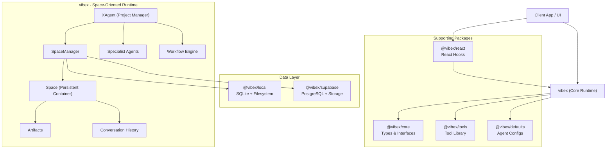
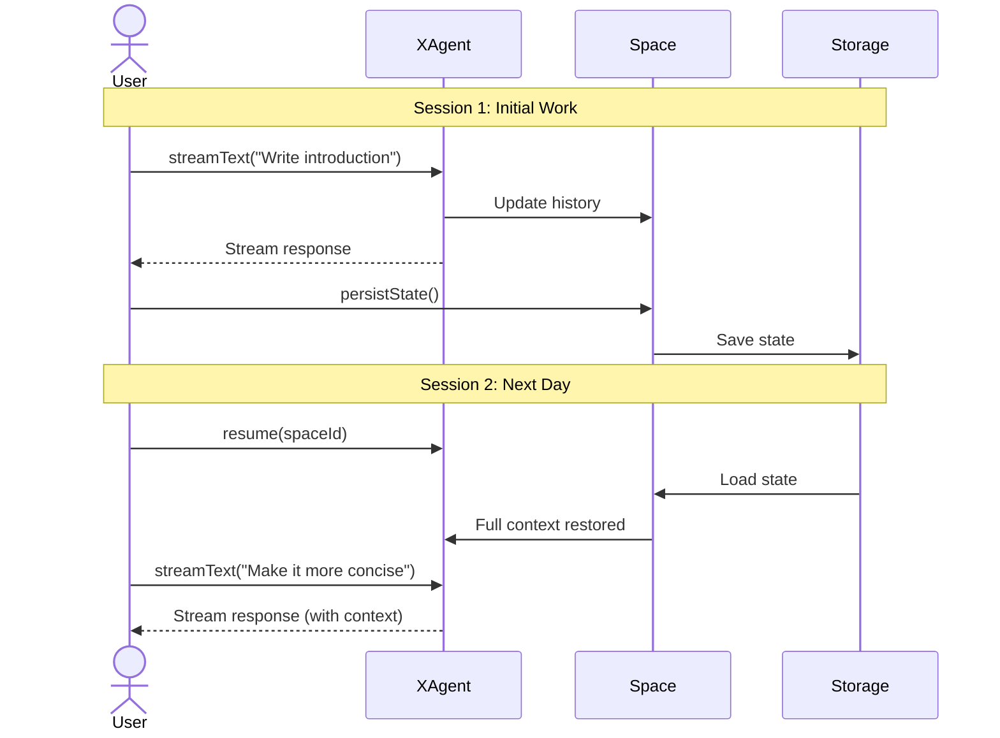

# VibeX System Architecture

## Overview

VibeX is a **Space-oriented Collaborative Workspace Platform** designed for persistent, evolving work with AI agents. Unlike task-oriented frameworks that execute and terminate, VibeX provides persistent workspaces where artifacts evolve through continuous user-agent collaboration.

## Core Philosophy: Space-Oriented Design

### The Fundamental Difference

| Aspect               | Task-Oriented (Others)           | Space-Oriented (VibeX)                     |
| -------------------- | -------------------------------- | ------------------------------------------ |
| **Mental Model**     | "Run a task, get a result, done" | "Enter a space, evolve artifacts, iterate" |
| **Lifecycle**        | One-shot execution               | Persistent, continuous collaboration       |
| **State**            | Ephemeral (task context)         | Persistent (space with history)            |
| **User Interaction** | Fire-and-forget                  | Ongoing conversation                       |
| **Artifacts**        | Output files                     | Living documents that evolve               |

### Why Space-Oriented?

Real-world work is iterative. You don't write a document once—you draft, review, refine, and polish. VibeX is designed for this reality:

- **Persistent Spaces**: Your work survives across sessions
- **Evolving Artifacts**: Documents, code, and data improve over time
- **Continuous Collaboration**: Talk to XAgent today, continue tomorrow
- **Accumulated Context**: The system remembers everything about your project

## Core Design Principles

1. **Space-Centric**: All activities happen within a "Space" — a persistent container for agents, data, artifacts, and history
2. **Artifact Evolution**: Documents and files are living entities that improve over time with version tracking
3. **Session Continuity**: Users can resume work at any time with full context preserved
4. **Agent-First but Human-in-the-Loop**: Autonomous agents drive execution, but workflows natively support pausing for human input
5. **Storage Agnostic**: Seamlessly switches between local (SQLite/Filesystem) and cloud (Supabase/PostgreSQL) storage
6. **Core-Driven**: `vibex` package is the pure runtime engine that orchestrates all other packages

## High-Level Architecture



## Package Structure

### `vibex` — Core Runtime Engine

The main package that manages Spaces, XAgents, and artifact evolution.

**Key Components:**

- **XAgent**: Project manager that coordinates work within a Space
- **Space**: Persistent container for all work (artifacts, history, config)
- **Agent**: Base class for specialist agents
- **Workflow Engine**: DAG-based execution for complex multi-step operations

**Public API:**

```typescript
import { XAgent, Space } from "vibex";

// Start a new workspace
const xAgent = await XAgent.start("Write my thesis");
const space = xAgent.getSpace();

// Stream a response
const stream = await xAgent.streamText({
  messages: [{ role: "user", content: "Write the introduction" }],
  metadata: { mode: "agent", requestedAgent: "X" },
});

for await (const chunk of stream.textStream) {
  process.stdout.write(chunk);
}

// Save the workspace
await space.persistState();

// Resume later
const xAgent2 = await XAgent.resume(space.spaceId);
```

### `@vibex/core` — Shared Types & Interfaces

Defines all TypeScript types and interfaces used across packages:

- `XMessage`, `XMessagePart` — Conversation message types with parts
- `AgentConfig`, `AgentContext` — Agent configuration
- `CoreTool`, `ToolInfo` — Tool definitions
- `ResourceAdapter`, `StorageAdapter`, `KnowledgeAdapter` — Adapter interfaces

### `@vibex/local` — Local Storage Adapter

SQLite + filesystem implementation for local development:

```typescript
// Used internally by vibex when no cloud adapter is configured
// Stores data in ./data by default
```

**Storage Strategy:**
- **SQLite**: Structured data (spaces, messages, metadata)
- **Filesystem**: Artifact file content

### `@vibex/supabase` — Cloud Storage Adapter

PostgreSQL + Supabase Storage for production deployments:

```typescript
import { createSupabaseAdapter } from "@vibex/supabase";

const adapter = createSupabaseAdapter({
  supabaseUrl: process.env.SUPABASE_URL!,
  supabaseKey: process.env.SUPABASE_SERVICE_KEY!,
});
```

### `@vibex/tools` — Tool Library

Standard tools that agents can use:

- **File Operations**: Read, write, list files
- **Web Search**: Search the internet for information
- **Web Browsing**: Playwright-based browser automation

### `@vibex/defaults` — Configuration & Templates

Default agent configurations and prompt templates:

- **Agent Configs**: researcher, writer, developer, etc.
- **Prompt Templates**: System prompts for each agent type
- **Space Templates**: Pre-configured workspace setups

### `@vibex/react` — React Integration

React hooks for building UIs:

```typescript
import { useXChat } from "@vibex/react";

function Chat({ spaceId }: { spaceId: string }) {
  const { messages, append, isLoading, status } = useXChat({ spaceId });
  // ...
}
```

## Core Concepts

### Space

A **Space** is the persistent container for all work:

```typescript
interface Space {
  spaceId: string;        // Unique identifier
  name: string;           // Human-readable name
  goal: string;           // Workspace objective
  
  // Persistent State
  history: History;       // Conversation messages
  artifacts: Artifact[];  // Documents, code, data
  plan?: Plan;            // Current work plan
  
  // Runtime
  xAgent: XAgent;         // Project manager
  agents: Map<string, Agent>;  // Available specialists
  
  // Methods
  persistState(): Promise<void>;
  loadState(): Promise<void>;
}
```

### XAgent

**XAgent** is the user's primary interface to a Space:

- **Knows the Space**: Has access to all artifacts, history, and context
- **Remembers Everything**: Conversation history persists across sessions
- **Coordinates Work**: Delegates to specialist agents when needed
- **Adapts Plans**: Modifies approach based on user feedback

```typescript
class XAgent {
  // Factory methods
  static async start(goal: string, options?: XOptions): Promise<XAgent>;
  static async resume(spaceId: string, options?: XOptions): Promise<XAgent>;
  
  // Core methods
  getSpace(): Space;
  async streamText(options: StreamOptions): Promise<StreamResult>;
  async generateText(options: GenerateOptions): Promise<AgentResponse>;
  
  // Planning
  async createPlan(goal?: string): Promise<Plan>;
  async adaptPlan(feedback: string): Promise<Plan>;
  
  // Workflow execution
  async executeWorkflow(goal: string): Promise<string>;
}
```

### Artifacts

Artifacts are living documents that evolve over time:

- **Versioned**: Every change is tracked
- **Contextual**: Linked to conversations that created them
- **Persistent**: Survive across sessions

### Specialist Agents

Single-purpose experts that XAgent coordinates:

| Agent | Purpose |
| ----- | ------- |
| **Researcher** | Gathers and synthesizes information |
| **Writer** | Creates content and documentation |
| **Developer** | Writes and reviews code |
| **Reviewer** | Provides quality assurance |
| **Web Designer** | Creates HTML/CSS experiences |

## Data Flow

### Starting a New Workspace

```
User: XAgent.start("Write my thesis")
  ↓
XAgent: Create new Space
  ↓
Space: Initialize with goal, empty history
  ↓
XAgent: Return to user
  ↓
User: xAgent.streamText({ messages, metadata })
  ↓
XAgent: Process request, generate response
  ↓
Space: Update history
  ↓
User: space.persistState()
  ↓
Adapter: Save to SQLite/Supabase
```

### Resuming a Workspace

```
User: XAgent.resume(spaceId)
  ↓
Adapter: Load space data from storage
  ↓
Space: Reconstruct state (history, artifacts, plan)
  ↓
XAgent: Initialize with loaded Space
  ↓
User: Continue conversation with full context
```

### The Iterative Cycle



## Key Workflows

### 1. Continuous Document Editing

```typescript
// Day 1: Start a document
const xAgent = await XAgent.start("Write my thesis");
const space = xAgent.getSpace();

const stream = await xAgent.streamText({
  messages: [{ role: "user", content: "Write the introduction" }],
  metadata: { mode: "agent", requestedAgent: "X" },
});
// Process stream...
await space.persistState();

// Day 2: Continue refining
const xAgent2 = await XAgent.resume(space.spaceId);
await xAgent2.streamText({
  messages: [{ role: "user", content: "Make the abstract more concise" }],
  metadata: { mode: "agent", requestedAgent: "X" },
});
```

### 2. Multi-Session Research

```typescript
// Session 1: Gather sources
await xAgent.streamText({
  messages: [{ role: "user", content: "Research climate change impacts" }],
  metadata: { mode: "agent", requestedAgent: "X" },
});

// Session 2: Analyze (days later)
const xAgent = await XAgent.resume(spaceId);
await xAgent.streamText({
  messages: [{ role: "user", content: "Synthesize into key findings" }],
  metadata: { mode: "agent", requestedAgent: "X" },
});
// XAgent has full context from Session 1
```

## Comparison to Task-Oriented Frameworks

| Feature                   | VibeX                    | Task-Oriented Frameworks |
| ------------------------- | ------------------------ | ------------------------ |
| **Persistent Workspaces** | ✅ Core feature          | ❌ Not designed for this |
| **Artifact Evolution**    | ✅ Version history       | ❌ Output-only           |
| **Session Continuity**    | ✅ Built-in              | ⚠️ Manual state save     |
| **Context Accumulation**  | ✅ Space-scoped          | ⚠️ Memory with limits    |
| **One-shot Tasks**        | ⚠️ Possible but overkill | ✅ Optimized for this    |

## Security & Isolation

- **Space Isolation**: Each Space is a security boundary
- **Tool Sandboxing**: External operations are controlled
- **Audit Trail**: Complete history of all actions
- **User Scoping**: Spaces are scoped to users

## Future Roadmap

- **Real-time Collaboration**: Multi-user Spaces
- **Artifact Diff/Merge**: Handle concurrent edits
- **Space Templates**: Pre-configured workspaces for common tasks
- **Memory System**: Semantic memory with RAG integration
