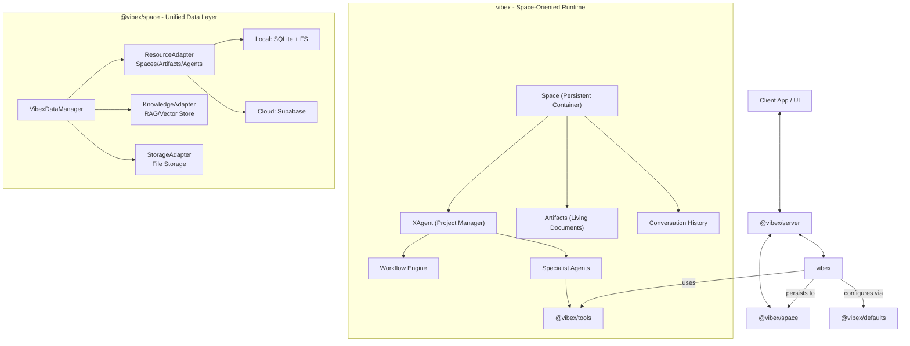

# Vibex System Architecture

## Overview

Vibex is a **Space-oriented Collaborative Workspace Platform** designed for persistent, evolving work with AI agents. Unlike task-oriented frameworks that execute and terminate, Vibex provides persistent workspaces where artifacts evolve through continuous user-agent collaboration.

## Core Philosophy: Space-Oriented Design

### The Fundamental Difference

| Aspect               | Task-Oriented (Others)           | Space-Oriented (Vibex)                     |
| -------------------- | -------------------------------- | ------------------------------------------ |
| **Mental Model**     | "Run a task, get a result, done" | "Enter a space, evolve artifacts, iterate" |
| **Lifecycle**        | One-shot execution               | Persistent, continuous collaboration       |
| **State**            | Ephemeral (task context)         | Persistent (space with history)            |
| **User Interaction** | Fire-and-forget                  | Ongoing conversation                       |
| **Artifacts**        | Output files                     | Living documents that evolve               |

### Why Space-Oriented?

Real-world work is iterative. You don't write a document once—you draft, review, refine, and polish. Vibex is designed for this reality:

- **Persistent Spaces**: Your work survives across sessions
- **Evolving Artifacts**: Documents, code, and data improve over time
- **Continuous Collaboration**: Talk to XAgent today, continue tomorrow
- **Accumulated Context**: The system remembers everything about your project

## Core Design Principles

1. **Space-Centric**: All activities happen within a "Space" — a persistent container for agents, data, artifacts, and history
2. **Artifact Evolution**: Documents and files are living entities that improve over time with version tracking
3. **Session Continuity**: Users can resume work at any time with full context preserved
4. **Agent-First but Human-in-the-Loop**: Autonomous agents drive execution, but workflows natively support pausing for human input
5. **Storage Agnostic**: Seamlessly switches between local (SQLite/Filesystem) and cloud (Supabase/PostgreSQL) storage
6. **Core-Driven**: `vibex` package is the pure runtime engine that orchestrates all other packages

## High-Level Architecture



## Package Responsibilities

### `vibex` - The Space-Oriented Runtime

**Role**: Pure runtime engine that manages Spaces, XAgents, and artifact evolution.

**Key Components**:

- **Space**: Persistent container for all work (artifacts, history, config)
- **XAgent**: Project manager that coordinates work within a Space
- **Artifacts**: Living documents with version history
- **Workflow Engine**: DAG-based execution for complex multi-step operations
- **Specialist Agents**: Writer, Researcher, Developer, etc.

**What it contains**:

- ✅ Space container management
- ✅ Mission lifecycle (user goals)
- ✅ Plan/Task management
- ✅ XAgent orchestration
- ✅ Artifact versioning logic
- ✅ Conversation history management
- ✅ Execution engine (internal workflows)
- ✅ Agent base classes

**What it does NOT contain**:

- ❌ Storage implementations (in `@vibex/space`)
- ❌ Vector store implementations (in `@vibex/space`)
- ❌ Database adapters (in `@vibex/space`)

### `@vibex/space` - Unified Data Persistence Layer

**Role**: Manages ALL data used by the runtime. Single source of truth for persistence.

**Adapters**:

- **ResourceAdapter**: Spaces, Missions, Plans, Tasks, Agents, Artifacts metadata
- **KnowledgeAdapter**: Document chunks, embeddings, vector search
- **StorageAdapter**: Artifact file content, blob management

**Implementations**:

- **Local**: SQLite (structured data) + Filesystem (files) + JSON (vectors)
- **Supabase**: PostgreSQL (structured data) + Supabase Storage (files) + pgvector (vectors)

### `@vibex/supabase` - Cloud Backend

**Role**: Concrete Supabase implementations of `@vibex/space` adapters.

### `@vibex/tools` - Tool Library

**Role**: Standard library of tools that agents can use.

- Web browsing (Playwright)
- File I/O
- Search operations
- Database tools

### `@vibex/react` - React Integration

**Role**: React-facing API for building frontends.

- React hooks (`useSpace`, `useChat`, etc.)
- Real-time artifact updates
- Server actions wrapper

### `@vibex/server` - Server Integration

**Role**: Server-only helpers for Next.js/Node.js.

- Next.js route handlers
- Server actions
- Background job workers

### `@vibex/defaults` - Configuration & Templates

**Role**: Default configurations and templates.

- Default agent configurations
- Prompt templates
- System defaults

## Key Workflows

### 1. Continuous Document Editing

```typescript
// Day 1: Start a document
const space = await XAgent.start("Write my thesis");
await space.uploadArtifact("thesis.md", initialContent);
await xAgent.chat("Write the introduction"); // Creates v1

// Day 2: Continue refining
const space = await XAgent.resume(spaceId);
await xAgent.chat("Make the abstract more concise"); // Creates v2

// Day 3: Final polish
await xAgent.chat("Review everything and fix any issues"); // Creates v3
```

### 2. Multi-Session Research

```typescript
// Session 1: Gather sources
await xAgent.chat("Research climate change impacts");
// Artifacts: sources.md, notes.md

// Session 2: Analyze
await xAgent.chat("Synthesize into key findings");
// Artifacts: findings.md (uses context from Session 1)

// Session 3: Write
await xAgent.chat("Write a report based on our findings");
// Artifacts: report.md (uses all accumulated context)
```

### 3. Collaborative Code Review

```typescript
const space = await XAgent.start("Review my PR");
await space.uploadArtifact("changes.diff", diffContent);

await xAgent.chat("Review for security issues");
// XAgent analyzes and provides feedback

await xAgent.chat("Now check for performance issues");
// Context includes previous security findings

await xAgent.chat("Generate a summary");
// Summary includes all findings from the session
```

## Data Flow

### Space Persistence

```
vibex (Runtime)
    ↓ saves/loads
@vibex/space (Data Layer)
    ↓ uses adapters
Local (SQLite/FS) or Supabase (PostgreSQL/Storage)
```

### Artifact Versioning

```
User: "Make it more concise"
    ↓
XAgent: Read artifact v2
    ↓
XAgent: Generate new content
    ↓
Space: Create artifact v3
    ↓
Storage: Persist v3, keep v1, v2
```

## Comparison to Task-Oriented Frameworks

| Feature                   | Vibex                    | Task-Oriented (e.g., Eko) |
| ------------------------- | ------------------------ | ------------------------- |
| **Persistent Workspaces** | ✅ Core feature          | ❌ Not designed for this  |
| **Artifact Evolution**    | ✅ Version history       | ❌ Output-only            |
| **Session Continuity**    | ✅ Built-in              | ⚠️ Manual state save      |
| **Context Accumulation**  | ✅ Space-scoped          | ⚠️ Memory with limits     |
| **One-shot Tasks**        | ⚠️ Possible but overkill | ✅ Optimized for this     |
| **Simple Automation**     | ⚠️ Over-engineered       | ✅ Perfect fit            |

## Future Roadmap

- **Memory System**: Semantic memory with RAG integration
- **Real-time Collaboration**: Multi-user Spaces
- **Artifact Diff/Merge**: Handle concurrent edits
- **Space Templates**: Pre-configured workspaces for common tasks
- **Edge Runtime**: Optimizing for V8 edge environments


