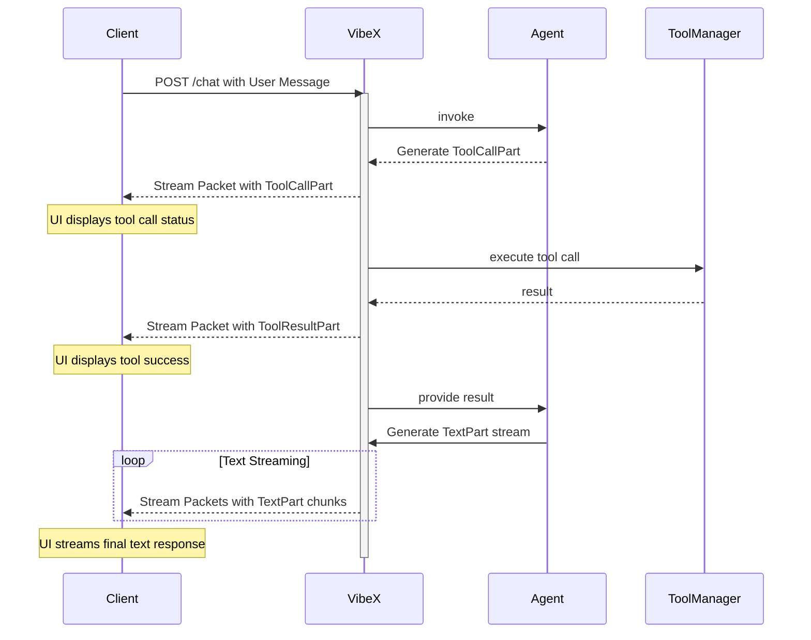

# Communication and Message Architecture

## 1. Core Principles

The communication architecture in VibeX is a critical component that enables the transparent, real-time feedback loop at the heart of the Vibe-X philosophy. It is designed to be robust, extensible, and streamable, drawing inspiration from modern standards like the Vercel AI SDK. The core principles are:

- **Message-Oriented**: The fundamental unit of communication is a `Message`. All interactions, whether from a user, an agent, or a tool, are encapsulated in this structure.
- **Composable Parts**: A `Message` is composed of a list of `Part` objects. This allows for rich, multi-modal content and a clear separation of concerns (e.g., text, tool calls, and tool results all have their own part type).
- **Streaming First**: The entire model is designed for real-time streaming. A `Message` and its `Part`s can be sent incrementally, allowing for responsive user interfaces and efficient data flow.

## 2. The `Message` and `Part` Schema

This section defines the core data structures for communication.

### 2.1. The `Message` Object

A `Message` represents a single entry in the conversation history. It contains a list of `Part` objects that make up its content.

```python
from pydantic import BaseModel, Field
from typing import List, Union, Literal, Dict, Any
import uuid

class Message(BaseModel):
    """
    Represents a single message in the conversation, composed of multiple parts.
    """
    id: str = Field(default_factory=lambda: f"msg_{uuid.uuid4().hex}")
    role: Literal["user", "assistant"]
    parts: List[Union[
        "TextPart",
        "ToolCallPart",
        "ToolResultPart",
        "ToolErrorPart"
    ]]
```

### 2.2. The `Part` Objects

These are the building blocks of a `Message`. Following the Vercel AI SDK pattern, we use camelCase for field names to ensure frontend compatibility.

#### `TextPart`

The simplest part, containing a piece of text. During streaming, multiple `TextPart` objects can be sent to represent a continuous flow of text.

```python
class TextPart(BaseModel):
    type: Literal["text"] = "text"
    text: str
```

#### `ToolCallPart`

A structured request from an agent to call a specific tool with a given set of arguments.

```python
class ToolCallPart(BaseModel):
    type: Literal["tool-call"] = "tool-call"
    toolCallId: str = Field(default_factory=lambda: f"tc_{uuid.uuid4().hex}")
    toolName: str
    args: Dict[str, Any]
```

#### `ToolResultPart`

The result of a tool execution. It is explicitly linked back to the originating call by its `toolCallId`.

```python
class ToolResultPart(BaseModel):
    type: Literal["tool-result"] = "tool-result"
    toolCallId: str
    toolName: str
    result: Any  # The structured output from the tool
    isError: bool = False  # Indicates if this is an error result
```

#### Extended Part Types

Beyond the core types, VibeX supports additional part types for richer agent interactions:

```python
# For image content
class ImagePart(BaseModel):
    type: Literal["image"] = "image"
    image: Union[str, bytes]  # URL, base64, or binary data
    mimeType: Optional[str] = None

# For file attachments
class FilePart(BaseModel):
    type: Literal["file"] = "file"
    data: Union[str, bytes]
    mimeType: str

# For multi-step operations
class StepStartPart(BaseModel):
    type: Literal["step-start"] = "step-start"
    stepId: str
    stepName: Optional[str] = None

# For agent reasoning transparency
class ReasoningPart(BaseModel):
    type: Literal["reasoning"] = "reasoning"
    content: str

# For error handling
class ErrorPart(BaseModel):
    type: Literal["error"] = "error"
    error: str
    errorCode: Optional[str] = None
```

## 3. Example Message Flows

### 3.1. Simple Text Conversation

**User Message:**

```json
{
  "role": "user",
  "parts": [{ "type": "text", "text": "Hello, world!" }]
}
```

**Assistant Response (streamed):**

```json
// Stream Packet 1
{ "role": "assistant", "parts": [{ "type": "text", "text": "Hello" }] }
// Stream Packet 2
{ "role": "assistant", "parts": [{ "type": "text", "text": " there!" }] }
```

### 3.2. Successful Tool Call Flow

This example shows the full lifecycle, from the agent requesting a tool to receiving the result.

**1. Assistant requests a tool call:**
The agent's message contains both explanatory text and a `ToolCallPart`.

```json
{
  "role": "assistant",
  "parts": [
    {
      "type": "text",
      "text": "Sure, I can write that file for you. I will now call the tool."
    },
    {
      "type": "tool-call",
      "toolCallId": "tc_123",
      "toolName": "write_file",
      "args": { "path": "/hello.txt", "content": "Hello, world!" }
    }
  ]
}
```

**2. The system provides the tool result:**
A new message is created containing the `ToolResultPart`. This is sent back to the agent for its next reasoning step.

```json
{
  "role": "assistant",
  "parts": [
    {
      "type": "tool-result",
      "toolCallId": "tc_123",
      "toolName": "write_file",
      "result": { "status": "success", "message": "File written successfully." },
      "isError": false
    }
  ]
}
```

**3. The agent generates its final response:**
After receiving the result, the agent formulates its final answer.

```json
{
  "role": "assistant",
  "parts": [
    {
      "type": "text",
      "text": "I have successfully written the file to `/hello.txt`."
    }
  ]
}
```

### 3.3. Tool Call with Self-Correction (Validation Error)

This flow demonstrates how `ToolErrorPart` enables the agent to fix its own mistakes.

**1. Assistant makes a malformed tool call (missing `path`):**

```json
{
  "role": "assistant",
  "parts": [
    {
      "type": "tool-call",
      "toolCallId": "tc_456",
      "toolName": "write_file",
      "args": { "content": "This call is missing the path." }
    }
  ]
}
```

**2. The VibeX Framework returns a `ToolErrorPart`:**
Instead of executing the tool, the system provides a structured validation error.

```json
{
  "role": "assistant",
  "parts": [
    {
      "type": "tool-result",
      "toolCallId": "tc_456",
      "toolName": "write_file",
      "result": "Validation failed for tool 'write_file': Missing required argument 'path'.",
      "isError": true
    }
  ]
}
```

**3. The agent receives the error and provides a corrected call:**
The error message is now part of the agent's context. Its `Brain` sees the mistake and generates a valid call in the next turn.

```json
{
  "role": "assistant",
  "parts": [
    {
      "type": "text",
      "text": "My apologies, I missed a required parameter. I will correct it now."
    },
    {
      "type": "tool-call",
      "toolCallId": "tc_789",
      "toolName": "write_file",
      "args": {
        "path": "/corrected.txt",
        "content": "This call should now be valid."
      }
    }
  ]
}
```

This new message now proceeds down the successful tool call path.

## 4. Streaming and Progressive Responses

To build a truly responsive UI, a client needs to be aware of the agent's progress throughout its turn, not just at the end. This is especially important for multi-step operations like tool calls. VibeX achieves this by streaming a sequence of `Message` updates for a single logical turn.

### 4.1. The Streaming Protocol

The client should not assume a single request will yield a single response. Instead, it should be prepared to receive multiple, distinct `Message` objects over the same streaming connection. Each object provides a real-time snapshot of the agent's activity.

The following sequence diagram illustrates how a client receives progressive updates during a tool call.



### 4.2. Example Streamed Packets

Here is what the client would see for the successful tool call flow from section 3.2, but as a real-time stream.

**1. Client sends a request:**
`POST /chat` with a user message asking to write a file.

**2. VibeX streams back the agent's decision to call the tool:**
The UI can immediately show that a tool is being used.

```json
{
  "role": "assistant",
  "id": "msg_abc",
  "parts": [
    {
      "type": "tool-call",
      "toolCallId": "tc_123",
      "toolName": "write_file",
      "args": { "path": "/hello.txt", "content": "Hello, world!" }
    }
  ]
}
```

**3. VibeX streams the result of the tool execution:**
The UI knows the tool call has completed successfully _before_ the agent has formulated its final textual response.

```json
{
  "role": "assistant",
  "id": "msg_abc",
  "parts": [
    {
      "type": "tool-result",
      "toolCallId": "tc_123",
      "toolName": "write_file",
      "result": { "status": "success", "message": "File written successfully." },
      "isError": false
    }
  ]
}
```

**4. VibeX streams the final text response, token by token:**
The `id` field links these text chunks back to the same logical message.

```json
// Packet 1
{ "role": "assistant", "id": "msg_abc", "parts": [{ "type": "text", "text": "I have" }] }
// Packet 2
{ "role": "assistant", "id": "msg_abc", "parts": [{ "type": "text", "text": " successfully" }] }
// Packet 3
{ "role": "assistant", "id": "msg_abc", "parts": [{ "type": "text", "text": " written the file." }] }
```

This progressive, part-based streaming model gives a UI all the information it needs to render a rich, real-time view of the agent's work.

## 5. Message Building and Streaming Workflow

### 5.1. The StreamingMessageBuilder

To ensure consistent message structure during streaming, VibeX uses a `StreamingMessageBuilder` that accumulates parts as they are generated:

```python
from vibex.core.message_builder import StreamingMessageBuilder

# Initialize builder for a new assistant message
builder = StreamingMessageBuilder(role="assistant")

# Add text as it streams
builder.add_text_delta("Let me check ")
builder.add_text_delta("the weather ")
builder.add_text_delta("for you.\n")

# Finalize text and add tool call
builder.finalize_text_part()  # Creates TextPart from accumulated text
part_index = builder.add_tool_call(
    tool_call_id="tc_weather_123",
    tool_name="get_weather",
    args={"location": "Tokyo"}
)

# Add tool result
part_index = builder.add_tool_result(
    tool_call_id="tc_weather_123",
    tool_name="get_weather",
    result={"temperature": 72, "condition": "sunny"},
    is_error=False
)

# Add final text
builder.add_text_delta("The weather in Tokyo is 72°F and sunny.")

# Build complete message
message = builder.build()
```

### 5.2. Streaming Events Protocol

VibeX emits a series of SSE (Server-Sent Events) to communicate message construction progress:

#### Event Types

1. **`message_start`**: Signals the beginning of a new message
   ```json
   {
     "event": "message_start",
     "data": {
       "message_id": "msg_abc123",
       "role": "assistant"
     }
   }
   ```

2. **`part_delta`**: Incremental updates to a part (typically text)
   ```json
   {
     "event": "part_delta",
     "data": {
       "message_id": "msg_abc123",
       "part_index": 0,
       "type": "text",
       "delta": "Let me check "
     }
   }
   ```

3. **`part_complete`**: A part has been finalized
   ```json
   {
     "event": "part_complete",
     "data": {
       "message_id": "msg_abc123",
       "part_index": 1,
       "part": {
         "type": "tool-call",
         "toolCallId": "tc_weather_123",
         "toolName": "get_weather",
         "args": {"location": "Tokyo"}
       }
     }
   }
   ```

4. **`message_complete`**: The entire message is ready
   ```json
   {
     "event": "message_complete",
     "data": {
       "message": {
         "id": "msg_abc123",
         "role": "assistant",
         "content": "Let me check the weather for you.\nThe weather in Tokyo is 72°F and sunny.",
         "parts": [
           {"type": "text", "text": "Let me check the weather for you.\n"},
           {"type": "tool-call", "toolCallId": "tc_weather_123", "toolName": "get_weather", "args": {"location": "Tokyo"}},
           {"type": "tool-result", "toolCallId": "tc_weather_123", "toolName": "get_weather", "result": {"temperature": 72, "condition": "sunny"}, "isError": false},
           {"type": "text", "text": "The weather in Tokyo is 72°F and sunny."}
         ]
       }
     }
   }
   ```

### 5.3. Frontend State Management

The frontend maintains a streaming message state that progressively builds the UI:

```typescript
interface StreamingMessage {
  id: string;
  role: string;
  parts: MessagePart[];
  status: 'streaming' | 'complete';
  currentPartIndex?: number;
}

// Handle streaming events
switch (event.type) {
  case "message_start":
    // Initialize new streaming message
    streamingMessages.set(data.message_id, {
      id: data.message_id,
      role: data.role,
      parts: [],
      status: 'streaming'
    });
    break;
    
  case "part_delta":
    // Update existing part or create new one
    const message = streamingMessages.get(data.message_id);
    if (data.type === "text") {
      if (!message.parts[data.part_index]) {
        message.parts[data.part_index] = { type: "text", text: "" };
      }
      message.parts[data.part_index].text += data.delta;
    }
    break;
    
  case "part_complete":
    // Replace part with complete version
    message.parts[data.part_index] = data.part;
    break;
    
  case "message_complete":
    // Finalize message and trigger persistence
    streamingMessages.set(data.message.id, {
      ...data.message,
      status: 'complete'
    });
    break;
}
```

### 5.4. Benefits of This Architecture

1. **Progressive Rendering**: UI updates smoothly as content streams
2. **Structured Data**: Maintains proper message/part relationships
3. **Tool Transparency**: Shows tool calls and results inline with text
4. **Error Recovery**: Failed tool calls don't break the message flow
5. **Multi-modal Support**: Easily extends to images, files, and other content types
6. **Backward Compatible**: The `content` field provides plain text fallback

This architecture ensures that every piece of agent activity is captured, structured, and communicated in real-time, embodying the Vibe-X philosophy of transparency and user empowerment.
