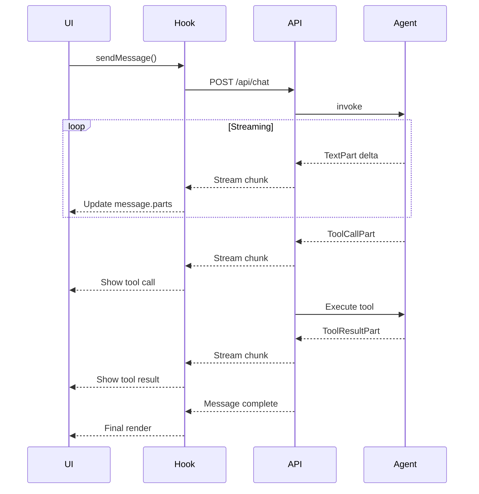

# Message Parts Architecture

## Overview

VibeX uses a parts-based message architecture aligned with AI SDK v6. This enables rich, structured messages that can contain multiple content types while supporting real-time streaming.

## Message Types

VibeX defines two message types for different contexts:

### Server-Side: `XMessage`

Used internally by the `vibex` package for LLM interactions and persistence:

```typescript
import type { XMessagePart } from "@vibex/core";

interface XMessage {
  id: string;
  role: "system" | "user" | "assistant" | "tool" | "data";
  parts: XMessagePart[];
  metadata?: {
    agentName?: string;
    timestamp?: number;
    [key: string]: unknown;
  };
  content?: string; // Backward compatibility
}
```

### Client-Side: `XChatMessage`

Used by `@vibex/react` for UI rendering:

```typescript
import type { UIMessagePart } from "ai";

interface XChatMessage {
  id: string;
  role: "user" | "assistant" | "system" | "tool" | "data";
  parts: UIMessagePart[];
  createdAt?: Date;
  metadata?: Record<string, unknown>;
  content?: string; // Backward compatibility
}
```

## Part Types

### Core Parts (from AI SDK)

```typescript
// Text content
interface TextPart {
  type: "text";
  text: string;
}

// Tool call request
interface ToolCallPart {
  type: "tool-call";
  toolCallId: string;
  toolName: string;
  args: Record<string, unknown>;
}

// Tool execution result
interface ToolResultPart {
  type: "tool-result";
  toolCallId: string;
  toolName: string;
  result: unknown;
  isError?: boolean;
}

// Agent reasoning (for transparency)
interface ReasoningPart {
  type: "reasoning";
  content: string;
}

// File attachments
interface FilePart {
  type: "file";
  data: string | Uint8Array;
  mimeType: string;
}

// Multi-step operation markers
interface StepStartPart {
  type: "step-start";
  stepId: string;
  stepName?: string;
}
```

### VibeX-Specific Parts

```typescript
// Artifact references
interface ArtifactPart {
  type: "artifact";
  artifactId: string;
  title: string;
  version?: number;
  preview?: string;
}

// Plan updates
interface PlanUpdatePart {
  type: "plan-update";
  planId: string;
  action: "created" | "updated" | "completed" | "failed";
  details?: Record<string, unknown>;
}
```

## Utility Functions

### Server-Side (`@vibex/core`)

```typescript
import {
  getTextFromParts,
  createTextMessage,
  hasPendingApproval,
  getToolCalls,
  getArtifacts,
  normalizeMessage,
} from "@vibex/core";

// Extract text content
const text = getTextFromParts(message.parts);

// Create a simple text message
const msg = createTextMessage("assistant", "Hello!");

// Check for pending tool approvals
if (hasPendingApproval(message)) {
  // Handle approval flow
}
```

### Client-Side (`@vibex/react`)

```typescript
import {
  getMessageText,
  messageNeedsApproval,
  getPendingApprovals,
  createUserMessage,
  isStatusLoading,
} from "@vibex/react";

// Get display text from message
const displayText = getMessageText(message);

// Check if message needs approval
if (messageNeedsApproval(message)) {
  const pending = getPendingApprovals(message);
  // Show approval UI
}

// Create user message for sending
const userMsg = createUserMessage("Hello, agent!");
```

## Streaming Architecture

### Progressive Rendering

Messages are streamed part-by-part for responsive UI:



### Chat Status States

```typescript
type XChatStatus =
  | "idle" // No active request
  | "submitted" // Request sent, waiting
  | "streaming" // Receiving response
  | "awaiting-approval" // Tool needs approval
  | "error"; // Error occurred
```

## React Integration

```typescript
import { useXChat, type XChatMessage } from "@vibex/react";

function Chat({ spaceId }: { spaceId: string }) {
  const {
    messages,
    input,
    setInput,
    append,
    status,
    isLoading,
    approveToolCall,
  } = useXChat({ spaceId });

  // Render messages with parts
  return (
    <div>
      {messages.map((msg) => (
        <Message key={msg.id} message={msg} />
      ))}
      {status === "awaiting-approval" && (
        <ApprovalUI
          message={messages[messages.length - 1]}
          onApprove={(id) => approveToolCall(id, true)}
          onReject={(id) => approveToolCall(id, false)}
        />
      )}
    </div>
  );
}

function Message({ message }: { message: XChatMessage }) {
  return (
    <div className={message.role === "user" ? "user-msg" : "assistant-msg"}>
      {message.parts.map((part, i) => (
        <Part key={i} part={part} />
      ))}
    </div>
  );
}

function Part({ part }: { part: UIMessagePart }) {
  switch (part.type) {
    case "text":
      return <p>{part.text}</p>;
    case "tool-call":
      return <ToolCallCard toolCall={part} />;
    case "tool-result":
      return <ToolResultCard result={part} />;
    case "artifact":
      return <ArtifactPreview artifact={part} />;
    default:
      return null;
  }
}
```

## Benefits

1. **Progressive Rendering**: UI updates smoothly as content streams
2. **Structured Data**: Maintains proper message/part relationships
3. **Tool Transparency**: Shows tool calls and results inline with text
4. **Type Safety**: Full TypeScript types for all message structures
5. **Multi-modal Support**: Easily extends to images, files, and custom types
6. **Backward Compatible**: The `content` field provides plain text fallback
7. **Approval Flow**: Native support for human-in-the-loop tool execution
