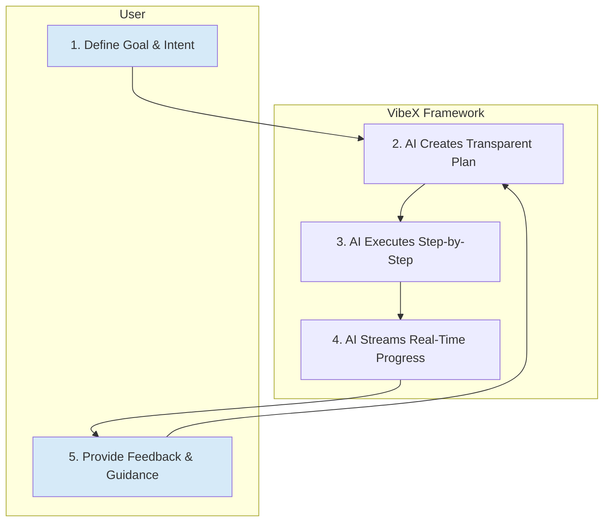

# The Collaborative Loop: A Project's Lifecycle

In VibeX, a project is not a "fire-and-forget" task. It's a dynamic, transparent, and iterative process designed to augment human experts by fostering a continuous dialogue between the user and the AI agent team. This entire lifecycle is structured as a **Collaborative Loop**.

This document explains the stages of this loop and how it translates the Vibe-X philosophy into a tangible workflow.

## The Core Principle: A Transparent Feedback Loop

The fundamental problem with many AI systems is their "black box" nature. You provide an input, wait, and then get an output, with no visibility into the process. If the output is flawed, you have no choice but to start over.

VibeX is built on the opposite principle: **complete transparency**. The entire execution process is streamed in real-time, creating a tight feedback loop that empowers the user to guide, correct, and collaborate with the AI.



This loop consists of three key phases: **Planning**, **Execution & Observation**, and **Feedback & Adaptation**.

## 1. Phase One: Intention & Planning

Every project begins with a human's intent. This could be a high-level goal, a specific instruction, or a question.

- **User Input**: The user provides a prompt, such as "Analyze our competitor's new landing page and write a report on its key strengths."
- **XAgent Initialization**: The user starts a project through `XAgent.start()`, which returns an XAgent instance that will manage the entire project lifecycle.
- **Plan Creation**: The `XAgent` receives this goal and, in collaboration with a specialized `PlannerAgent`, breaks it down into a structured, human-readable `Plan`. This plan is not a hidden internal state; it's an artifact (`plan.md`) that lives in the project's workspace.

**Why this is different:** The plan itself is the first point of collaboration. The user can inspect the proposed steps, identify misunderstandings, and refine the approach _before_ any significant work (and token cost) is invested.

**Example Plan (`plan.md`):**

```markdown
# Goal: Analyze competitor's landing page and write a report.

- [ ] **Task 1: Research** - Find and download the HTML content of the competitor's landing page.
  - **Agent**: `Researcher`
  - **Tool**: `web_search`
- [ ] **Task 2: Analyze** - Analyze the structure, copy, and key value propositions from the HTML.
  - **Agent**: `Analyst`
- [ ] **Task 3: Draft Report** - Write a draft of the report based on the analysis.
  - **Agent**: `Writer`
  - **Depends on**: Task 2
- [ ] **Task 4: Review** - Review the report for clarity, accuracy, and tone.
  - **Agent**: `Reviewer`
  - **Depends on**: Task 3
```

## 2. Phase Two: Execution & Observation

Once the plan is established, the `XAgent` begins executing the tasks. This is where the transparent feedback loop becomes critical.

- **Step-by-Step Execution**: The `XAgent` picks the next available task from the plan and assigns it to the appropriate specialist agent.
- **"Showing Its Work"**: The agent doesn't work in silence. VibeX streams the agent's "internal monologue" in real-time—which tools it's invoking, what parameters it's using, what its intermediate conclusions are.
- **Real-Time Artifacts**: As agents create or modify files, those changes are streamed and immediately available in the workspace.

**Why this is different:** This transparency provides crucial **"jump-in moments."** The user isn't a passive observer; they are an active supervisor who can see exactly what the AI is doing and why.

## 3. Phase Three: Feedback & Adaptation

Because the user has full visibility, they can provide feedback at any point in the process.

- **User Intervention**: The user can interrupt the process with new instructions. For example: "Actually, before you write the report, also check their pricing page."
- **Intelligent Adaptation**: The `XAgent` receives this new instruction and intelligently adapts the plan. It doesn't just start over. It determines which completed tasks are still valid (e.g., the initial page research) and which need to be modified or added.
- **Work Preservation**: The framework is designed to preserve as much completed work as possible, saving both time and money. The `XAgent` will only re-run the necessary steps, not the entire project.

**Why this is different:** This transforms the interaction from a rigid, transactional process into a fluid, conversational collaboration. The user can steer the project with the same natural language they would use with a human team member.

## Conclusion: A Lifecycle for Augmentation

The VibeX project lifecycle is a deliberate departure from the "black box" model of AI. By designing the entire process around a transparent, iterative, and interruptible loop, the framework elevates the AI from a simple tool to a true collaborative partner. It's a lifecycle built not for automation, but for **augmentation**, ensuring the human expert remains firmly in control.
