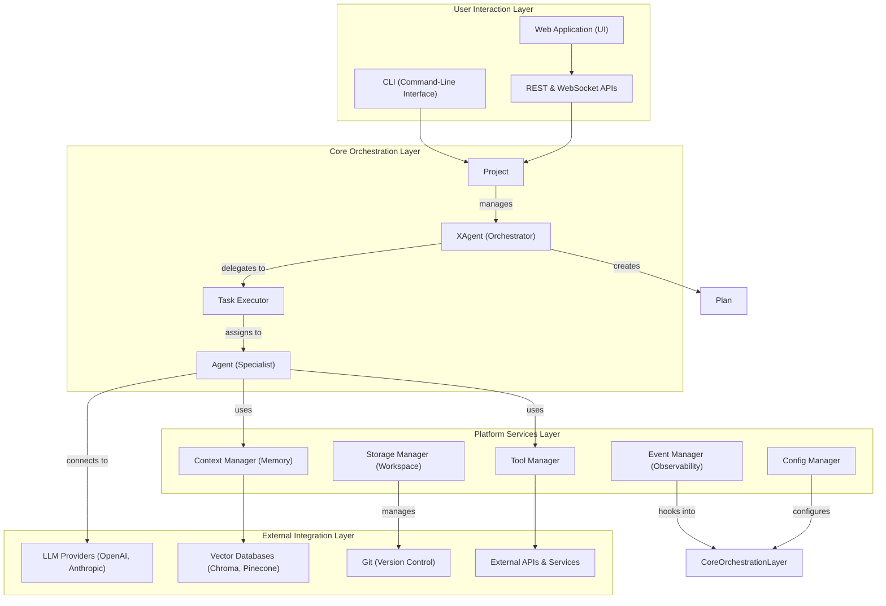
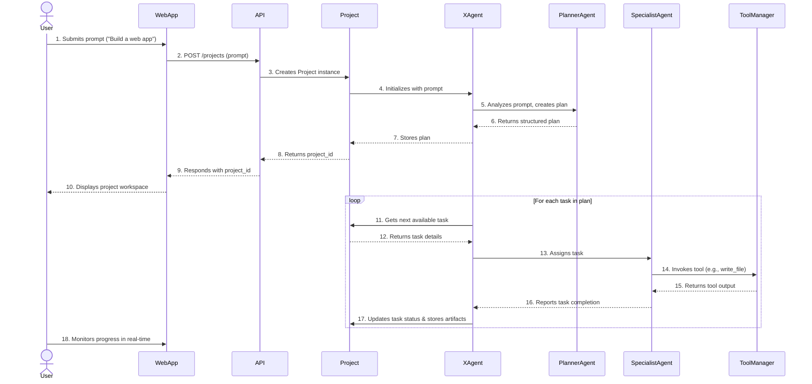

# VibeX System Architecture

VibeX is an extensible framework for building, running, and observing multi-agent systems. It provides the foundational infrastructure for teams of AI agents to collaborate on complex tasks, enabling them to plan, execute, use tools, and manage long-term memory within isolated, persistent project environments.

## Core Concepts

At the heart of VibeX are a few key concepts that work together to enable sophisticated multi-agent collaboration.

### 1. Project

A **Project** is the primary unit of work in VibeX. It encapsulates everything needed to achieve a high-level goal, from the initial user request to the final generated artifacts. Each project is a self-contained environment with its own:

- **Isolated Workspace**: A dedicated directory for storing all project-related files, including configurations, logs, and generated artifacts. This ensures that projects do not interfere with one another.
- **State**: The current status of the project, including the execution plan, task progress, and conversation history.
- **Team Configuration**: A definition of the agents and tools available to the project.
- **Version Control**: Automatic versioning of all artifacts, enabling traceability and rollback capabilities.

### 2. XAgent: The Primary Interface

**XAgent** is the primary interface to VibeX. Each XAgent instance represents exactly one project and uses the project's ID as its identifier. This 1:1 relationship means when you interact with an XAgent, you're interacting with its project. The XAgent is responsible for:

- **Project Representation**: Acting as the conversational interface for a specific project
- **Understanding User Intent**: Interpreting user requests and translating them into actionable plans
- **Planning and Decomposition**: Breaking down complex goals into a series of smaller, manageable tasks
- **Task Delegation**: Assigning tasks to the appropriate specialist agents based on their capabilities
- **Communication**: Relaying progress and results back to the user in a clear, conversational manner

Think of the XAgent as your AI collaborator. When you create an XAgent with `XAgent.start()`, it creates a project internally. When you resume with `XAgent.resume(project_id)`, you're reconnecting with that project's XAgent.

### 3. Agent: The Specialist

An **Agent** is a specialized entity designed to perform a specific type of work. Each agent has a defined role (e.g., researcher, writer, coder) and a set of tools it can use to accomplish its tasks. Key characteristics of agents include:

- **Domain Expertise**: Agents are configured with prompts and tools that make them experts in a particular domain.
- **Task-Oriented**: They receive specific, well-defined tasks from the XAgent and focus on completing them.
- **LLM Connection (Brain)**: Each agent has an internal `Brain` that connects it to Large Language Models (LLMs). This component handles all aspects of LLM interaction, including API calls, response streaming, and cost tracking, abstracting away the complexity of different providers.
- **Statelessness**: Agents do not maintain memory between tasks. This design choice keeps them focused, scalable, and predictable. All necessary context is provided by the framework at runtime.

### 4. Plan and Task: The Blueprint for Execution

A **Plan** is the structured blueprint that outlines how a project's goal will be achieved. It consists of a series of **Tasks**, where each task represents a discrete unit of work.

- **Hierarchical Structure**: Plans can be hierarchical, with tasks and sub-tasks that can be executed sequentially or in parallel.
- **Task Dependencies**: The framework supports defining dependencies between tasks, ensuring that work is performed in the correct order.
- **Dynamic Adaptation**: Plans are not static. The XAgent can modify the plan based on new information or user feedback, allowing the system to adapt to changing requirements.
- **Artifact Association**: Each task is associated with the artifacts it produces, creating a clear lineage from the plan to the final output.

## System Architecture

VibeX is designed with a layered architecture to ensure a clear separation of concerns, promote modularity, and facilitate extensibility. This design allows different parts of the system to evolve independently and enables developers to customize or replace components without affecting the entire application.



### 1. User Interaction Layer

This is the topmost layer, providing the interfaces for users to interact with the VibeX framework.

- **Web Application (UI)**: A rich, browser-based interface for managing projects, interacting with agents, and observing real-time progress.
- **REST & WebSocket APIs**: A set of well-defined API endpoints for programmatic control. The REST API handles state management, while WebSockets provide real-time event streaming.
- **Command-Line Interface (CLI)**: A powerful tool for developers and power users to manage projects, run tasks, and debug the system from the terminal.

### 2. Core Orchestration Layer

This layer contains the central logic for managing the lifecycle of projects and coordinating the work of agents.

- **Project**: The main container that encapsulates all state, configuration, and resources for a given task.
- **XAgent**: The orchestrator responsible for planning, delegating, and communicating with the user.
- **Task Executor**: The runtime engine that manages the execution of individual tasks, including preparing the necessary context for agents and handling errors.
- **Agent**: The specialist that performs the actual work using its configured tools and intelligence.

### 3. Platform Services Layer

This layer provides a suite of essential services that support the core orchestration layer. These services are designed to be pluggable, allowing for customization and extension.

- **Tool Manager**: Securely provides agents with access to tools, handling execution, parameter validation, and permissions.
- **Context Manager (Memory)**: Provides agents with access to long-term memory, enabling them to recall information from previous conversations, documents, and task results.
- **Storage Manager (Workspace)**: Manages the persistent storage of project workspaces, including artifacts, logs, and version history.
- **Event Manager (Observability)**: Captures and broadcasts events throughout the system, providing a comprehensive audit trail and enabling real-time monitoring.
- **Config Manager**: Loads and provides access to system-wide and project-specific configurations.

### 4. External Integration Layer

This is the lowest layer, responsible for interacting with external services and data sources.

- **LLM Providers**: Integrations with third-party LLM providers like OpenAI, Anthropic, and Google.
- **Vector Databases**: Connectors for various vector databases used by the Context Manager for long-term memory.
- **Git**: Integration with Git for automatic version control of all project artifacts.
- **External APIs & Services**: Any other external tools or services that agents might need to interact with to complete their tasks.

## Data and Communication Flow

Understanding how data moves through VibeX is key to understanding the system's behavior. The following sections describe the project lifecycle and the real-time streaming capabilities of the framework.

### Project Lifecycle

The following diagram illustrates the typical lifecycle of a project, from the initial user request to the final completion.



**Lifecycle Stages:**

1.  **Initiation**: A user submits a high-level goal through a client interface (e.g., the Web App).
2.  **Project Creation**: The system creates a new `Project` instance with an isolated workspace and an `XAgent`.
3.  **Planning**: The `XAgent` collaborates with a `PlannerAgent` to break down the goal into a structured `Plan` of `Tasks`.
4.  **Execution**: The `XAgent` iterates through the plan, assigning each task to the appropriate `SpecialistAgent`.
5.  **Tool Use**: `SpecialistAgents` use tools via the `ToolManager` to perform their work, generating artifacts and results.
6.  **State Updates**: As tasks are completed, the `Project` state is continuously updated, and all generated artifacts are saved to the workspace.
7.  **Completion**: Once all tasks are finished, the project is marked as complete, with a full history and all artifacts available for review.

### Real-Time Streaming

VibeX is designed for real-time interaction. The framework uses WebSockets to stream events, logs, and data as they are generated, providing a transparent and interactive user experience.

- **Event Streaming**: Every action in the system—from task creation to tool execution—is broadcast as a structured event. This allows the UI to display real-time progress indicators, logs, and notifications.
- **LLM Token Streaming**: When an agent communicates with an LLM, the response is streamed token by token. This means users see text appearing in real-time, just as it's being generated by the model.
- **Artifact Streaming**: For large files, the content can be streamed to the client, allowing users to preview documents or view log files as they are being written.

This streaming-first approach eliminates black boxes and provides complete transparency into the inner workings of the system.

## Cross-Cutting Concerns

Several important concerns apply across the entire VibeX framework. These are handled by dedicated components to ensure consistency, security, and performance.

### 1. Configuration Management

VibeX uses a flexible, file-based configuration system to define the behavior of agents, teams, and the overall environment. This allows you to define complex multi-agent systems without writing extensive code.

- **Declarative Configuration**: Key aspects of the system, such as agents, teams, and tool permissions, are defined in simple YAML files.
- **Hierarchical Structure**: Configuration is applied in a hierarchical manner, with project-specific settings overriding global defaults.
- **Dynamic Loading**: Configurations are loaded at runtime, allowing for changes without requiring a system restart.

**Example Team Configuration:**

```yaml
# config/team.yaml
agents:
  - name: researcher
    role: "Expert at finding and synthesizing information from the web."
    model: gpt-4-turbo
    tools: [web_search, read_file]

  - name: writer
    role: "A professional writer who specializes in creating clear and concise documentation."
    model: claude-3-opus
    tools: [write_file, read_file]

project:
  parallel_tasks: 3
  timeout: 3600
```

### 2. Extensibility

The VibeX framework is designed to be highly extensible, allowing developers to add new capabilities with minimal effort.

- **Custom Agents**: New agents can be created by defining their role, capabilities, and personality in a configuration file. No custom code is required for simple agents.
- **Custom Tools**: Adding new tools is as simple as decorating a Python function. The framework handles the necessary boilerplate for argument validation, execution, and error handling.

  ```python
  @tool("analyze_csv")
  def analyze_csv(file_path: str) -> dict:
      """
      Performs a statistical analysis of the data in a CSV file.
      """
      # Your implementation here
      ...
      return {"mean": 42.0, "std_dev": 5.7}
  ```

- **Pluggable Backends**: Key components like storage, memory, and LLM providers can be swapped out with custom implementations, allowing for integration with a wide variety of external services.

### 3. Security and Multi-Tenancy

Security is a fundamental design principle of VibeX. The framework includes several features to ensure that projects run in a secure and isolated manner.

- **Project Isolation**: Each project is confined to its own workspace, preventing any interference with other projects. File system access is strictly limited to the project's directory.
- **Tool Sandboxing**: The `ToolManager` acts as a security layer, validating all tool calls and ensuring that agents only have access to the tools they are permitted to use.
- **Access Control**: In a multi-tenant environment, VibeX can be configured to enforce user-based access control, ensuring that users can only access their own projects.
- **Audit Logging**: The `EventManager` captures a complete and immutable log of all actions taken within the system, providing a comprehensive audit trail for security and debugging purposes.

### 4. Performance and Scalability

VibeX is architected to handle demanding, long-running tasks and can be scaled to support a large number of concurrent projects.

- **Asynchronous Architecture**: The entire framework is built on Python's `asyncio`, enabling high-performance, non-blocking I/O for all operations.
- **Parallel Execution**: The `TaskExecutor` can run multiple tasks concurrently, significantly speeding up the overall project completion time.
- **Stateless Agents**: Because agents are stateless, the system can be scaled horizontally by simply adding more agent worker processes.
- **Caching**: VibeX includes a multi-layer caching system that can cache LLM responses, tool outputs, and context queries to reduce latency and cost.

## API Layer

The framework provides both programmatic and server APIs:

### Programmatic API
XAgent serves as the primary interface for all framework interactions:

- `XAgent.start()`: Create and start a new project, returns XAgent instance
- `XAgent.resume()`: Resume an existing project by ID
- `XAgent.list_projects()`: List all available projects
- `await x.chat()`: Direct conversational interaction
- `await x.execute()`: Autonomous execution
- `x.project`: Access underlying project when needed

### Server API (REST + SSE)
- `/agents`: Create and list XAgent instances
- `/agents/{project_id}/chat`: Conversational interface with XAgent (using project ID)
- `/agents/{project_id}/events`: Real-time event stream from XAgent
- `/agents/{project_id}/artifacts`: Access files created by XAgent

Note: The `{project_id}` in agent endpoints is the same as the project ID - each XAgent shares its project's identifier.
