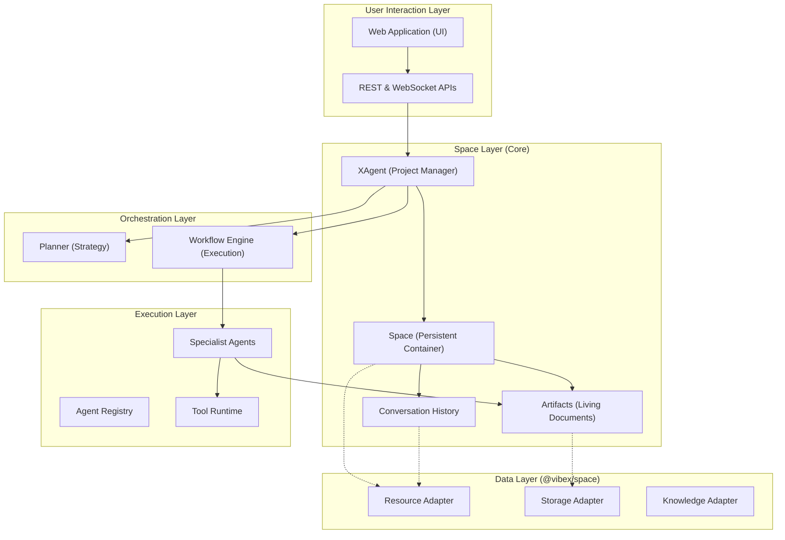
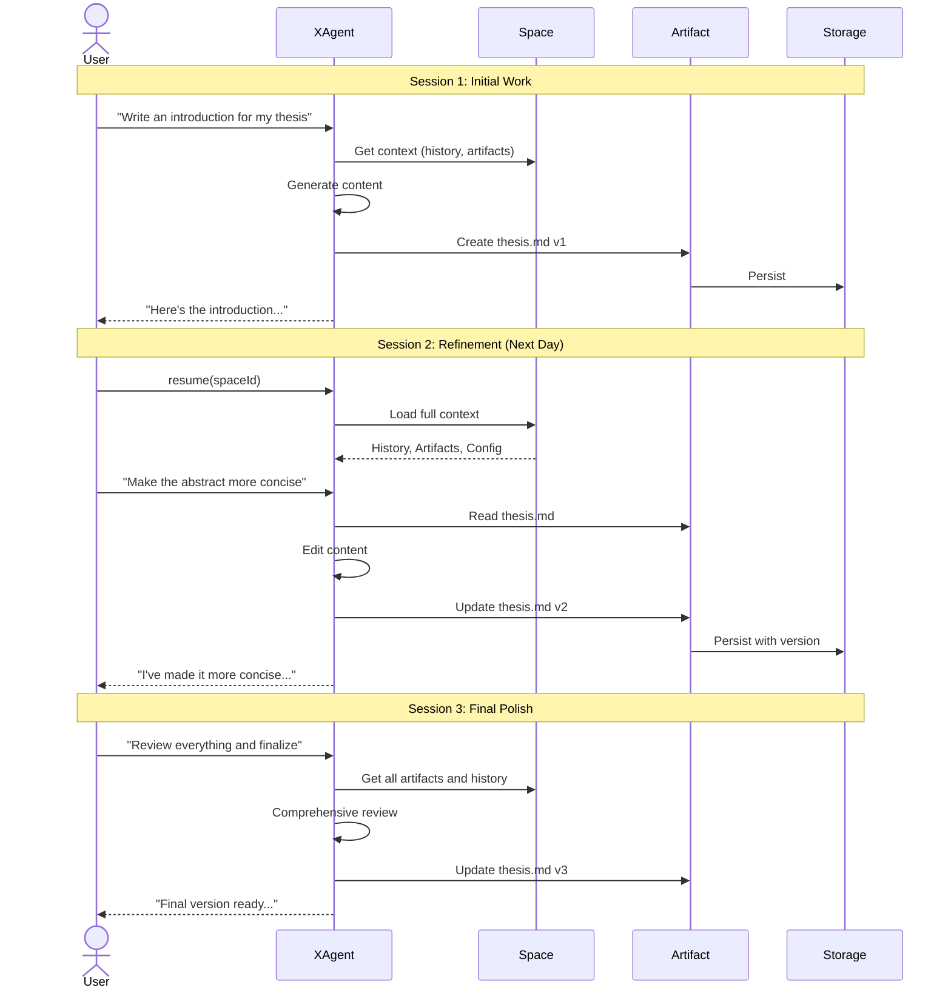

# Vibex System Architecture

Vibex is a **Space-oriented collaborative workspace platform** for building, running, and observing multi-agent systems. Unlike task-oriented frameworks that execute and terminate, Vibex provides persistent workspaces where artifacts evolve through continuous user-agent collaboration.

## Core Philosophy

### Task-Oriented vs Space-Oriented

| Aspect               | Task-Oriented (e.g., Eko)           | Space-Oriented (Vibex)                                            |
| -------------------- | ----------------------------------- | ----------------------------------------------------------------- |
| **Mental Model**     | "Run a task, get a result, done"    | "Enter a space, evolve artifacts, iterate"                        |
| **Lifecycle**        | One-shot execution                  | Persistent, continuous collaboration                              |
| **State**            | Ephemeral (task context)            | Persistent (space with history)                                   |
| **User Interaction** | Fire-and-forget                     | Ongoing conversation                                              |
| **Artifacts**        | Output files                        | Living documents that evolve                                      |
| **Example**          | "Write a report" → report.md → done | "Let's work on this report together" → iterate → refine → version |

## Core Concepts

### 1. Space (The Persistent Container)

A **Space** is the fundamental unit of work in Vibex. It's a persistent container that holds:

```typescript
interface Space {
  id: string; // Unique identifier
  name: string; // Human-readable name

  // Persistent State
  artifacts: Artifact[]; // Documents, code, data
  history: ConversationHistory; // All messages across sessions
  missions: Mission[]; // User's substantial goals

  // Configuration
  config: SpaceConfig; // Settings and preferences
  agents: Map<string, Agent>; // Available specialist agents

  // Timestamps
  createdAt: Date;
  updatedAt: Date;

  // The Project Manager
  xAgent: XAgent;
}
```

**Key Properties:**

- **Persistent**: Survives across sessions, days, weeks
- **Self-contained**: All context needed for the work is within the Space
- **Versioned**: Artifact changes are tracked over time
- **Resumable**: Pick up exactly where you left off

### 2. Mission (User's Substantial Goal)

A **Mission** represents a substantial goal with a lifecycle:

```typescript
interface Mission {
  id: string;
  title: string;
  status: "active" | "paused" | "completed" | "abandoned";

  // Strategy
  plan: Plan; // Contains Tasks

  // Progress
  progress: number; // 0-100

  // Timestamps
  createdAt: Date;
  completedAt?: Date;
}

interface Plan {
  goal: string;
  tasks: Task[]; // Individual work items
}

interface Task {
  id: string;
  title: string;
  status: "pending" | "running" | "completed" | "failed";
  assignedTo?: string; // Agent ID
}
```

> **Note**: Our "Task" is different from AI SDK's "steps" (multi-turn tool loops). Vibex Tasks are higher-level work items.

### 3. XAgent (The Project Manager)

**XAgent** is the user's primary interface to a Space. Unlike generic agents, XAgent:

- **Knows the Space**: Has access to all artifacts, history, and context
- **Remembers Everything**: Conversation history persists across sessions
- **Coordinates Work**: Delegates to specialist agents when needed
- **Adapts Plans**: Modifies approach based on user feedback

```typescript
class XAgent extends Agent {
  private space: Space;

  // Resume a conversation from any point
  async resume(spaceId: string): Promise<Space>;

  // Create and adapt plans
  async createPlan(goal: string): Promise<Plan>;
  async adaptPlan(feedback: string): Promise<Plan>;

  // Continuous conversation
  async streamText(options: StreamOptions): Promise<StreamResult>;

  // Artifact operations
  async editArtifact(id: string, instructions: string): Promise<Artifact>;
}
```

### 4. Artifacts (Living Documents)

Artifacts are the **primary outputs** of work in a Space. Unlike static files, artifacts in Vibex:

- **Evolve**: Modified through continuous conversation
- **Versioned**: Every change is tracked
- **Contextual**: Linked to the conversations that created them

```typescript
interface Artifact {
  id: string;
  name: string;
  content: Buffer | string;
  mimeType: string;

  // Version history
  versions: ArtifactVersion[];
  currentVersion: number;

  // Context
  createdBy: string; // Agent or user who created it
  lastModifiedBy: string;
  relatedMessages: string[]; // Messages that reference this artifact
}
```

### 5. Conversation History (Persistent Memory)

Unlike ephemeral chat contexts, Vibex maintains **complete conversation history**:

```typescript
interface ConversationHistory {
  messages: VibexMessage[];

  // Across sessions
  getMessagesFromSession(sessionId: string): VibexMessage[];
  getMessagesAboutArtifact(artifactId: string): VibexMessage[];

  // Context for agents
  getRecentContext(tokenLimit: number): VibexMessage[];
}
```

## System Architecture Layers



### Layer 1: User Interaction

Users interact with Vibex through:

- **Web UI**: React-based interface with real-time updates
- **API**: REST for CRUD, WebSocket for streaming

All interactions flow through **XAgent**, ensuring consistent context.

### Layer 2: Space Layer (The Core)

The heart of Vibex. This layer manages:

- **Mission lifecycle**: Creation, execution, completion of user goals
- **Plan management**: Strategy that evolves with user feedback
- **Task execution**: Individual work items within Plans
- **Artifact management**: Versioning, storage, retrieval
- **History management**: Conversation persistence across sessions
- **XAgent coordination**: The project manager for each Space

Note: A **Space** is a persistent container—it doesn't have a "lifecycle" with start/end. **Missions** within a Space have lifecycles (active → completed). The Space itself persists indefinitely.

### Layer 3: Orchestration Layer

When complex multi-step work is needed:

- **Planner**: Generates workflow definitions from goals
- **Engine**: Executes workflows with pause/resume capability

### Layer 4: Execution Layer

Where actual work happens:

- **Specialist Agents**: Writer, Researcher, Developer, etc.
- **Tools**: File I/O, web search, code execution, etc.

### Layer 5: Data Layer

Unified persistence through `@vibex/space`:

- **ResourceAdapter**: Spaces, Tasks, Agents, Artifacts metadata
- **StorageAdapter**: Artifact file content
- **KnowledgeAdapter**: Vector embeddings for RAG

## Data Flow: The Iterative Cycle

Unlike one-shot execution, Vibex follows an iterative cycle:



## Key Differentiators

### 1. Persistent Context

```typescript
// Traditional: Context lost after each run
const result = await agent.run("Write a report");
// Next call has no memory of the report

// Vibex: Context persists forever
const space = await XAgent.start("Write my thesis");
await xAgent.chat("Write the introduction");
// ... days later ...
const space = await XAgent.resume(spaceId);
await xAgent.chat("Now work on chapter 2");
// XAgent remembers everything
```

### 2. Artifact Evolution

```typescript
// Traditional: Create and forget
await agent.writeFile("report.md", content);

// Vibex: Evolve over time
await xAgent.chat("Write a draft"); // v1
await xAgent.chat("Add more examples"); // v2
await xAgent.chat("Make it more formal"); // v3
const history = await space.getArtifactHistory("report.md");
// Can rollback to any version
```

### 3. Multi-Session Collaboration

```typescript
// Traditional: Each session is independent
// Session 1
await agent.run("Research topic X");
// Session 2 - starts fresh, no memory

// Vibex: Sessions are continuous
// Session 1
await xAgent.chat("Research topic X");
// Session 2 - full context preserved
await xAgent.chat("Now synthesize our research");
// XAgent knows everything from Session 1
```

## Cross-Cutting Concerns

### Observability

XAgent emits events for all significant actions:

- `artifact:created`, `artifact:updated`, `artifact:versioned`
- `message:sent`, `message:received`
- `agent:delegated`, `agent:completed`
- `space:saved`, `space:resumed`

### Security

- **Space Isolation**: Each Space is a security boundary
- **Tool Sandboxing**: External operations are controlled
- **Audit Trail**: Complete history of all actions

## Package Structure

```
vibex/                    # Core runtime (Space, XAgent, Agents)
@vibex/space/            # Data persistence layer
@vibex/tools/            # Tool implementations
@vibex/react/            # React integration
@vibex/supabase/         # Cloud backend
@vibex/defaults/         # Configuration templates
```

## Summary

Vibex is not a task runner—it's a **collaborative workspace platform**. The key insight is that real work is iterative:

1. **Spaces** persist across sessions
2. **Artifacts** evolve through conversation
3. **XAgent** remembers everything
4. **History** accumulates context

This enables workflows that traditional agent frameworks cannot support: continuous document editing, multi-session research, iterative refinement, and true human-AI collaboration.
